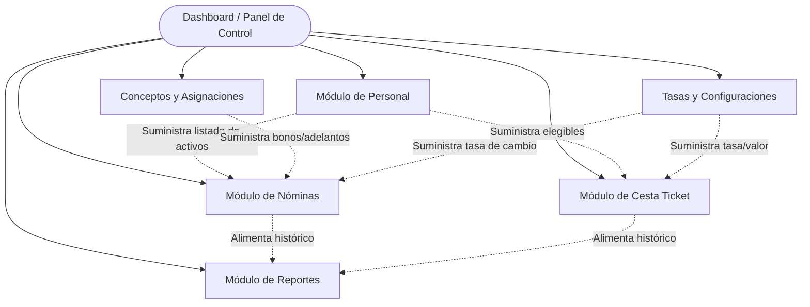
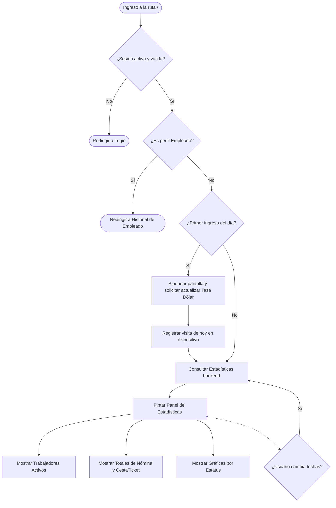
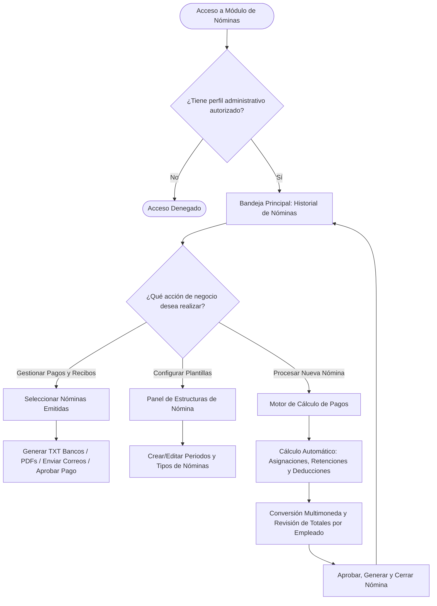
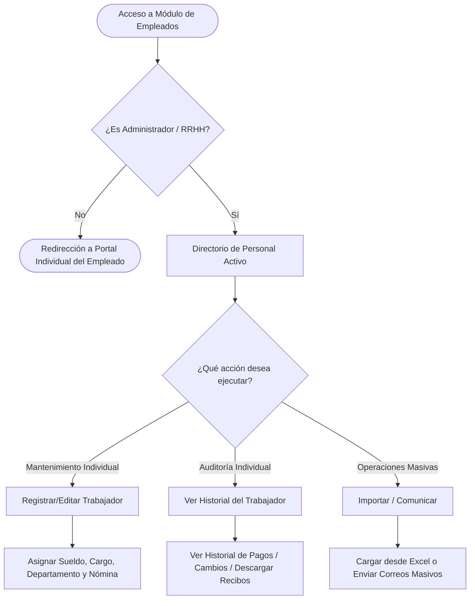
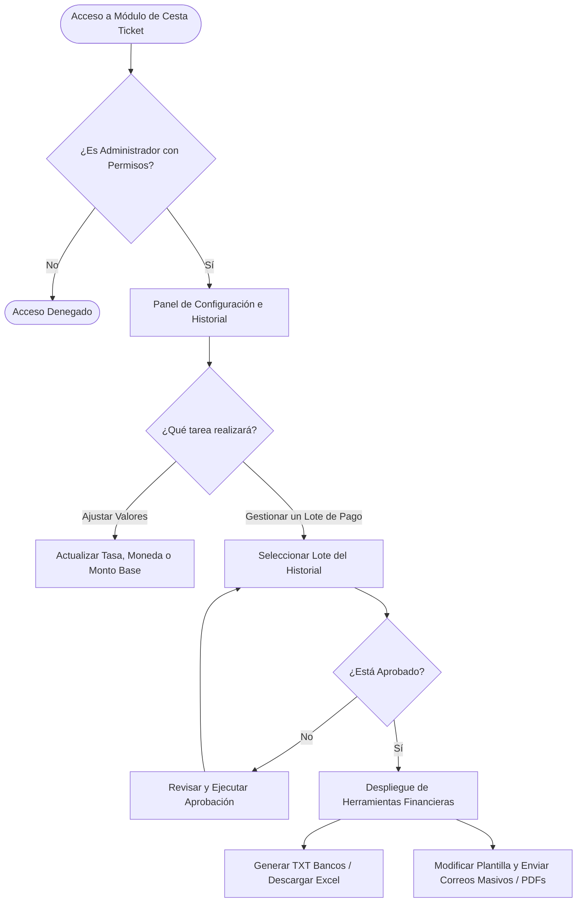
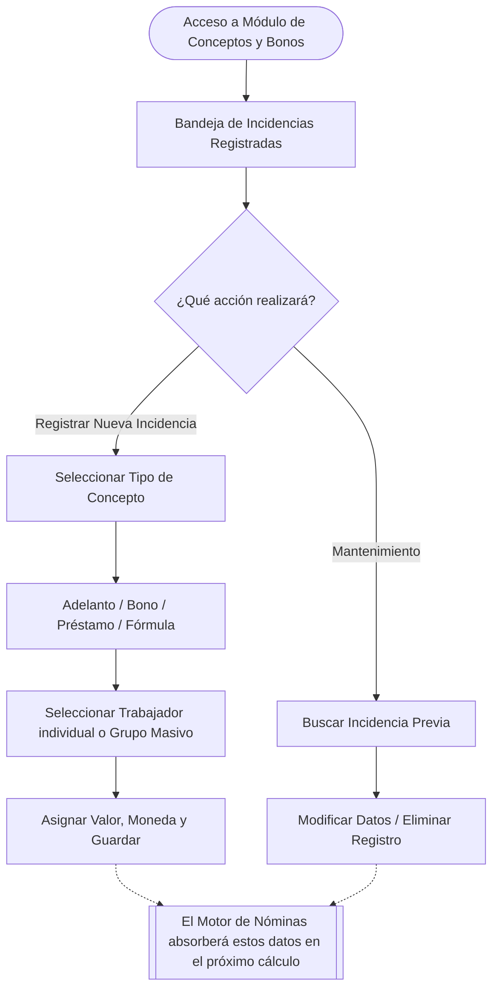
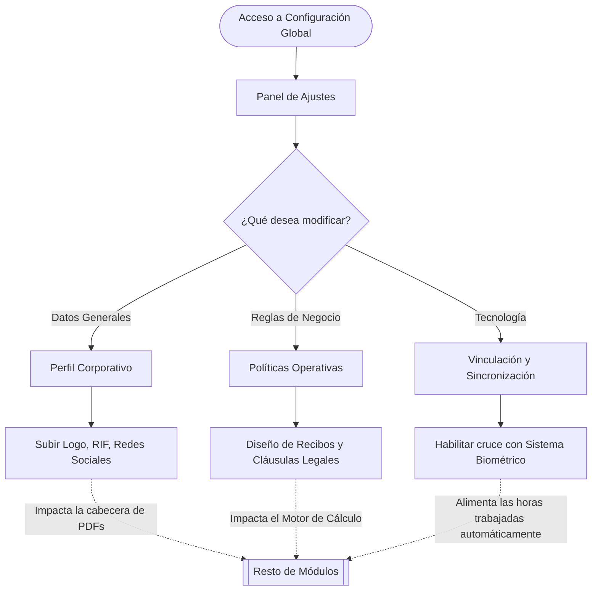

# Arquitectura Funcional del Sistema de Nómina

Este documento describe el funcionamiento del sistema a nivel lógico, sus reglas de negocio y cómo interactúan los distintos módulos entre sí.

## Módulos Principales (Vista General)

---

## 1. Módulo: Inicio (Dashboard / Panel de Control)

El módulo de inicio es la pantalla principal que ve el administrador al iniciar sesión. Su propósito principal es brindar un resumen estadístico del estado actual de la nómina y garantizar que variables diarias importantes (como la tasa de cambio) estén al día.

### Flujo Lógico y Funcionalidades Principales

1. **Autenticación y Control de Acceso**:
   - Valida que exista una sesión activa. Si no la hay, redirige al usuario a la pantalla de Login.
   - Identifica el rol del usuario. Si es un empleado regular (Tipo 2), se le restringe el acceso al Dashboard y se le redirige a su propio portal de historial de recibos (`/nomina/userHistory`).
   - Carga los permisos específicos del administrador y el año de operación activo de la empresa.

2. **Validación de Tasa de Cambio (Dólar) Diaria**:
   - Al cargar el Dashboard, el sistema revisa (vía almacenamiento local) si es el primer ingreso del día.
   - Si es el primer ingreso, se despliega una **ventana emergente obligatoria** que pide al usuario "Actualizar Valor del Dólar" antes de permitirle operar el sistema. Esto asegura que los cálculos del día usen la tasa correcta.

3. **Consulta de Estadísticas Generales**:
   - Por defecto, el sistema consulta las estadísticas desde el primer día del mes actual hasta hoy.
   - El administrador puede usar un selector de fechas ("Fecha desde" y "Fecha hasta") para filtrar las estadísticas de otros períodos y presionar "Consultar".

4. **Indicadores Clave Mostrados (KPIs)**:
   - **Trabajadores Activos**: Total de empleados que se encuentran actualmente activos en la plataforma.
   - **Nóminas Generadas**: Cantidad total de procesos de nómina realizados en el rango de fechas.
   - **Cestatickets Generados**: Cantidad total de cestatickets procesados en el rango de fechas.
   - **Detalle por Estatus**: Desglose y gráficas de pastel que muestran en qué estado se encuentran tanto las Nóminas como los Cestatickets (ej. cuántos están pendientes, aprobados, pagados, etc.).

### Diagrama de Flujo del Inicio

---

## 2. Módulo: Gestión de Nóminas

Este módulo es el núcleo central para la visualización, configuración y emisión de los pagos de la empresa. Funciona como un espacio de trabajo unificado que adapta su interfaz según el proceso de negocio que se esté ejecutando (Historial, Configuración o Emisión).

### Procesos y Funcionalidades Principales

1. **Proceso 1: Historial y Control de Pagos (Bandeja Principal)**:
   - Actúa como el registro histórico de la empresa.
   - Permite visualizar todas las nóminas generadas, filtrarlas por mes, nómina específica o estatus (Por Emitir, En Proceso, Aprobada, Pagada, Anulada).
   - **Acciones de Negocio**: Desde aquí se cambia el estatus de las nóminas (ej. aprobar un pago). También es el centro de salida de información: permite generar archivos TXT para pagar por el banco, enviar los recibos de pago por correo a todos los trabajadores de forma masiva, y descargar PDFs o reportes en Excel.

2. **Proceso 2: Configuración de Estructuras de Nómina**:
   - Es el panel donde se definen las "reglas y plantillas" estructurales.
   - Permite crear, modificar o eliminar grupos de nóminas (por ejemplo: Nómina Obreros, Nómina Administrativa).
   - Permite establecer la periodicidad de pago de cada grupo (Semanal, Quincenal, Mensual, etc.) y si dicho grupo incluye cálculos de Cestatickets.

3. **Proceso 3: Motor de Cálculo y Emisión**:
   - Es la herramienta de procesamiento de pagos. Toma la plantilla configurada y a los trabajadores activos asociados a ella para un periodo de fechas determinado.
   - **Cálculo Automático**: Analiza los días laborados, inasistencias y el sueldo base del trabajador, y calcula renglón por renglón todas las *Asignaciones* (bonos, primas), *Retenciones* (impuestos, seguro social) y *Deducciones* (préstamos, adelantos).
   - **Impacto Multimoneda**: Convierte y refleja automáticamente los totales usando la tasa de cambio del día, permitiendo al administrador actualizar la tasa de la moneda en tiempo real si es necesario.
   - **Cierre**: Muestra un resumen general con los montos a pagar de la empresa y una tabla detallada por empleado. Si los cálculos son correctos, el administrador aprueba la generación, lo que bloquea el borrador y traslada la nómina al Historial de Pagos.

### Diagrama de Flujo del Proceso de Nómina

---

## 3. Módulo: Gestión de Personal (Empleados)

Este módulo es el directorio central de capital humano de la empresa. Permite a los administradores de recursos humanos gestionar el ciclo de vida, datos personales y asignaciones salariales de todos los trabajadores. 

### Procesos y Funcionalidades Principales

1. **Directorio y Expediente del Trabajador**:
   - Presenta un panel principal con la base de datos de los trabajadores activos, indicando a qué grupo de nómina pertenecen, su departamento y datos de contacto.
   - Permite registrar a un nuevo trabajador vinculándolo desde el primer momento con:
     - **Estructura Salarial y Cargo**: Definición del Cargo que ocupará, sueldo base, moneda de pago, y modalidad de pago (mensual o en base a horas).
     - **Clasificación**: Departamento, sede y tipo de nómina a la que pertenece.
     - **Conceptos Personalizados**: A nivel individual, el formulario incluye una pestaña para configurar Asignaciones, Retenciones y Deducciones específicas que aplicarán exclusivamente a ese empleado, sirviendo de complemento a la configuración general de su nómina.
     - **Datos Bancarios y Personales**: Registro de múltiples cuentas bancarias, fechas de ingreso, y carga familiar (fundamental para el cálculo de primas en el motor de fórmulas).

2. **Operaciones Masivas y Mantenimiento**:
   - **Migración de Datos**: Incluye una herramienta avanzada para cargar empleados masivamente mediante la importación de un archivo Excel, validando automáticamente que todos los campos requeridos estén correctos antes de guardarlos.
   - **Comunicación**: Permite seleccionar a múltiples empleados y enviarles comunicados por correo electrónico directamente desde la plataforma.

3. **Auditoría e Historial Individual**:
   - **Historial de Pagos**: El administrador puede revisar el récord de pagos históricos específicos de un solo trabajador sin tener que buscar en las nóminas globales.
   - **Historial de Cambios**: Mantiene un registro de auditoría si se le modifica el sueldo, el cargo o algún dato sensible al trabajador.
   - **Recibos**: Generación directa de los recibos de pago mensuales en formato PDF para un trabajador en particular.

### Diagrama de Flujo de Gestión de Personal

---

## 4. Módulo: Gestión de Beneficios (Cesta Ticket)

Este módulo está dedicado exclusivamente a la administración, configuración y pago del beneficio de alimentación (Cesta Ticket), el cual, por su naturaleza legal y operativa, se maneja de forma independiente a la nómina salarial estándar.

### Procesos y Funcionalidades Principales

1. **Configuración de Parámetros Bases**:
   - Permite al administrador definir las reglas globales para el cálculo de este beneficio.
   - **Variables configurables**: Se establece el monto base de referencia, la moneda en la que se calcula (por ejemplo, indexado a una moneda extranjera) y la fórmula o descripción legal que aparecerá en los recibos.

2. **Historial y Aprobación de Pagos**:
   - Presenta una bandeja con todos los lotes de Cesta Ticket que han sido procesados.
   - **Flujo de Aprobación**: Los lotes generados entran en estado "No Aprobado" por defecto. Un administrador debe revisarlos y ejecutar la acción de "Aprobar Pago" para consolidarlos oficialmente.

3. **Operaciones Financieras y Salida de Datos**:
   Una vez que un pago está aprobado, el módulo habilita un abanico de herramientas de distribución:
   - **Generación de Archivos Bancarios (TXT)**: Permite crear automáticamente los archivos de texto con el formato exacto que exigen los bancos (ej. BNC, Mercantil) para realizar el pago masivo a las cuentas de los trabajadores.
   - **Distribución de Recibos**: Capacidad de generar todos los recibos en formato PDF para impresión, o enviarlos de forma masiva a los correos electrónicos de los empleados con un solo clic.
   - **Personalización de Correos**: Incluye un editor para modificar la plantilla del correo electrónico (asunto, remitente y cuerpo del mensaje) que recibirán los trabajadores junto a su recibo de pago.
   - **Exportación Contable**: Descarga de sábanas de datos en Excel para cuadres administrativos.

### Diagrama de Flujo de Cesta Ticket

---

## 5. Módulo: Conceptos, Bonos, Préstamos y Descuentos

Este módulo funciona como el "libro contable de incidencias" del personal. Es el lugar donde se registran todas las asignaciones o deducciones extraordinarias y recurrentes que afectarán el pago de uno o varios trabajadores en su próxima nómina.

### Procesos y Funcionalidades Principales

1. **Gestión de Incidencias Múltiples**:
   El sistema soporta cinco tipos principales de conceptos que modifican el sueldo:
   - **Adelantos de Pago**: Anticipos sobre el salario base.
   - **Préstamos**: Deuda adquirida por el empleado que se descontará de su liquidación o pagos.
   - **Bonos**: Asignaciones monetaria fija.
   - **Bono por Fórmula**: Bonificaciones dinámicas (ej. porcentajes o reglas matemáticas).
   - **Descuento por Fórmula**: Penalizaciones o deducciones variables.

2. **Asignación Individual o Grupal**:
   - Para maximizar la eficiencia, el administrador no tiene que registrar un bono empleado por empleado. Puede seleccionar un grupo de trabajadores (o a toda una nómina) y aplicarles el mismo concepto simultáneamente.
   - La plataforma muestra avatares de los trabajadores afectados para confirmar visualmente quiénes recibirán el concepto.

3. **Manejo Multimoneda**:
   - Cada adelanto o bono puede ser registrado en la moneda base local o en una moneda extranjera de referencia. Al momento de que el Motor de Nóminas calcule el pago, convertirá este valor a la moneda principal del trabajador usando la tasa de cambio vigente.

4. **Registro, Edición y Eliminación**:
   - Cuenta con un panel central que lista todas las incidencias registradas con su fecha.
   - Permite modificar el valor de un bono antes de que la nómina sea cerrada, o eliminar conceptos si fueron aplicados por error.

### Diagrama de Flujo de Conceptos y Bonos

---

## 6. Módulo: Configuración Global y Políticas (Settings)

Este módulo es el panel de control administrativo de más alto nivel. Centraliza toda la parametrización de la empresa y define el comportamiento general que tendrán el resto de los módulos (como qué mostrar en los recibos o cómo conectarse con sistemas externos). 

Está dividido en tres grandes secciones o sub-procesos:

### 1. Configuración Principal (Perfil Corporativo)
- **Identidad Gráfica y Legal**: Permite cargar el logotipo de la empresa (que aparecerá en todos los reportes y recibos PDF), el nombre legal, el número de documento fiscal (RIF) y los datos de contacto corporativos (teléfonos, correos, página web).
- **Presencia Digital**: Gestión de enlaces directos a las redes sociales de la empresa.

### 2. Políticas Operativas (Motor de Nómina)
Desde aquí se activan o desactivan las reglas de negocio globales:
- **Activación de Módulos**: Permite encender o apagar el uso de Cesta Tickets.
- **Parametrización de Recibos**: El administrador puede elegir exactamente qué nivel de detalle ven los empleados en sus recibos de pago. Puede activar la visualización de: Días extra laborados, días perdidos, horas extra, horas perdidas y secciones detalladas de métodos de pago. También permite alternar entre formatos de recibos (Simples vs. Detallados).
- **Datos Contables Bases**: Se establece el "Año Fiscal de Inicio" del sistema y se visualiza cuál es la moneda principal por defecto.
- **Cláusulas Legales**: Permite redactar textos fijos opcionales que aparecerán impresos automáticamente al final de todos los recibos (nómina, utilidades, cestaticket), ideal para colocar coletillas legales o mensajes corporativos recurrentes.

### 3. Vinculación e Integración Externa
- **Seguridad (Token de Acceso)**: Genera y custodia una llave o token único que permite que otras aplicaciones externas se comuniquen de forma segura con el sistema de nómina.
- **Sincronización Avanzada (Control de Asistencia)**: Permite vincular el sistema de nómina con un sistema externo de Control de Acceso (Biométricos). Esta política activa el cruce automatizado de datos, inyectando directamente los "días laborados" y "días faltantes" desde los relojes de asistencia al motor de cálculo de pagos.

### Diagrama de Flujo de Configuración

---

## 7. Módulo: Tiempos y Beneficios (Almuerzos, Días y Horas)

Este conjunto de submódulos se encarga de registrar las variaciones en el tiempo laboral de los trabajadores y beneficios diarios específicos (como los almuerzos). Toda la información alimentada aquí será tomada por el motor de nómina para calcular deducciones por inasistencias o bonificaciones por tiempo extra.

### Procesos y Funcionalidades Principales

1. **Gestión de Días Laborales**:
   Permite registrar incidencias sobre jornadas completas:
   - **Días Extras**: Días que el trabajador laboró fuera de su horario regular (fines de semana, feriados) que deben ser remunerados adicionalmente.
   - **Días Perdidos (Faltas)**: Inasistencias injustificadas que generarán una deducción en el salario final.
   - El sistema permite registrar estas incidencias indicando el trabajador afectado y la cantidad de días.

2. **Gestión de Horas Laborales**:
   Permite un control más granular para incidencias que no abarcan un día completo:
   - **Horas Extras**: Tiempo adicional trabajado después de la jornada regular.
   - **Horas Tardes / Perdidas**: Tiempo que el trabajador llegó tarde o se ausentó durante su jornada.
   - Al igual que los días, se asocian al trabajador indicando la cantidad de horas exactas.

3. **Control de Almuerzos**:
   - Funciona como un registro histórico de los beneficios de alimentación (almuerzos) entregados a los empleados por día.
   - Permite seleccionar un trabajador y marcar la fecha exacta en la que recibió o hizo uso del beneficio de almuerzo.

### Interconexión del Módulo

- **Alimentación Manual o Automática**: Los Días Extras/Perdidos pueden ser registrados a mano por el administrador en este módulo, o (si se habilitó en la Configuración Global) pueden ser inyectados automáticamente desde un sistema Biométrico de Control de Asistencia.
- **Impacto en Recibos**: Dependiendo de las Políticas configuradas, estos días y horas pueden desglosarse visualmente en el recibo PDF que recibe el trabajador, justificando así aumentos o deducciones en su pago.

---

## 8. Módulo: Reportes y Estadísticas

Este módulo es la herramienta analítica del sistema. Su propósito es consolidar la información procesada por los motores de cálculo y presentarla de forma resumida para el análisis financiero y gerencial.

### Procesos y Funcionalidades Principales

1. **Generación de Reportes por Rango de Fechas**:
   - El administrador puede definir un período de tiempo específico (`Fecha desde` y `Fecha hasta`) para enmarcar su consulta.
   
2. **Tipos de Consulta**:
   - **Reporte de Pagos Realizados**: Permite obtener un consolidado de todas las erogaciones (pagos de nómina, bonos, cestatickets) que la empresa ha efectuado efectivamente en el período seleccionado.
   - *(La arquitectura del módulo está preparada para escalar e incluir futuros reportes como "Reportes de Gastos" o análisis demográficos).*

3. **Flujo de Operación**:
   - El usuario selecciona los filtros.
   - El sistema procesa la solicitud consultando todo el histórico de nóminas cerradas y conceptos emitidos en ese lapso.
   - Devuelve un resumen estadístico útil para auditoría y contabilidad.

---

## 9. Módulo: Monedas y Tasas de Cambio

Este módulo es fundamental para la capacidad multimoneda del sistema. Actúa como el centro de conversión para todo el motor de nómina y configuración de bonos, permitiendo que la empresa maneje beneficios en divisas que luego son pagados en moneda local (o viceversa).

### Procesos y Funcionalidades Principales

1. **Gestión de Divisas**:
   - Permite crear, modificar y eliminar un catálogo de monedas que la empresa utilizará para sus transacciones internas.
   - Cada moneda registrada cuenta con su Nombre, Código (ej. USD, VED), Símbolo (ej. $, Bs) y Valor Referencial.

2. **Moneda Principal vs. Secundarias**:
   - **Moneda Principal**: El sistema requiere que se establezca una (y solo una) moneda como "Principal". Esta moneda actúa como la base del sistema y su valor siempre será fijado en `1`.
   - **Monedas Secundarias**: Todas las demás monedas agregadas serán "Secundarias" y su *Valor Referencial* (Tasa de Cambio) fluctuará en relación a la moneda principal.
   
3. **Actualización de Tasas y su Impacto**:
   - El administrador puede actualizar diariamente o según convenga la tasa de cambio de las monedas secundarias.
   - **Efecto en Cascada**: Al modificar la tasa aquí, cualquier Bono, Adelanto o deducción que un trabajador tenga asignado en una "Moneda Secundaria" será recalculado automáticamente al equivalente de la "Moneda Principal" durante la emisión de la próxima nómina.

---

## 10. Módulo: Motor de Fórmulas y Conceptos Personalizados

Este es posiblemente el módulo funcional más avanzado y flexible del sistema. Actúa como el cerebro matemático de la nómina. Dado que las leyes laborales y las políticas de compensación de las empresas cambian constantemente, este módulo permite a los administradores crear sus propias fórmulas matemáticas sin necesidad de reprogramar el sistema.

### Procesos y Funcionalidades Principales

1. **Gestión de Fórmulas Dinámicas**:
   El administrador puede crear conceptos bajo tres grandes categorías contables:
   - **Asignaciones**: Suman al pago del trabajador.
   - **Retenciones**: Restan del pago por obligaciones legales (ej. Seguro Social, Paro Forzoso).
   - **Deducciones**: Restan del pago por otras deudas o penalizaciones.

2. **Diccionario de Variables del Sistema**:
   Para armar las fórmulas, el sistema expone un amplio catálogo de variables dinámicas que se llenan automáticamente con los datos de cada empleado al momento de calcular la nómina:
   - **Financieras**: `CSueldo_Base`, `CSueldo_Periodo`, `CValor_Dia`, `CValor_Hora`.
   - **Tiempos**: `CDia_Extra`, `CDia_Faltante`, `CHora_Extra`, `CHora_Faltante`.
   - **Cronológicas y Demográficas**: `CLunesMes` (útil para beneficios que se pagan por cada lunes del mes), `CTiempo_Laborado` (Años de antigüedad), `CCarga_Familiar`, `CHijos_Total` (Hijos menores de 18 o con discapacidad).
   - **Acumuladas**: `CTotal_Asignacion`, `CTotal_Retencion` (Permite calcular porcentajes sobre el total devengado).

3. **Lógica Condicional**:
   - Una fórmula puede tener condiciones lógicas. Por ejemplo: *"Si los años de antigüedad son mayores a 5, aplicar fórmula A; si no, aplicar fórmula B"*.

### ¿Cómo se integra con la Generación de Nómina? (`resultRoster.js`)

Cuando el administrador ordena generar una nómina (Módulo de Gestión de Nóminas), el motor de cálculo realiza los siguientes pasos lógicos en milisegundos:
1. Recopila las asistencias, horas extras, prestamos y adelantos del trabajador.
2. Lee todas las fórmulas activas en este módulo.
3. **Fase de Reemplazo**: Intercambia las palabras clave (ej. `CSueldo_Base`) por el monto real del trabajador.
4. **Evaluación de dos tiempos**: 
   - Primero calcula las fórmulas independientes.
   - Luego calcula las fórmulas que dependen de un subtotal (aquellas que incluyen `CTotal_Asignacion`).
5. Ejecuta las matemáticas y produce el valor exacto a pagar, el cual se plasma en el recibo final.

---

## 11. Módulo: Configuración de Nóminas (Estructura)

Este módulo es donde se arman los diferentes "grupos" o "tipos" de nómina que manejará la empresa. Funciona como la plantilla principal a la que luego se asociarán los empleados.

### Procesos y Funcionalidades Principales

1. **Definición de Tipos de Nómina**:
   El administrador puede crear múltiples estructuras de pago (ej. "Nómina Administrativa", "Nómina Operativa", "Directivos"). Para cada una define:
   - **Periodicidad**: Semanal, Quincenal, Mensual o Zona Educativa. Esto le dice al motor de cálculo cuántas fracciones debe hacer del salario en el mes (ej. Quincenal divide entre 2).
   - **Tipo de Horario**: Fijo o Flexible.

2. **Vinculación con el Motor de Fórmulas**:
   - Una vez creada una nómina, el administrador debe indicarle qué conceptos (fórmulas matemáticas creadas en el módulo anterior) le aplican.
   - Selecciona de un catálogo las **Asignaciones**, **Retenciones** y **Deducciones** que son válidas exclusivamente para ese grupo de empleados.

3. **Integración y Generación de Cesta Ticket**:
   - Desde este mismo módulo se invoca la evaluación y generación del beneficio de alimentación (Cesta Ticket). El sistema valida si se está dentro de la fecha de pago (política de días establecida) y alerta al usuario si se intenta generar de forma prematura.
   - **Previsualización vs Generación**: El administrador cuenta con la opción de "Previsualizar" el cálculo descargando un Excel para validar los datos sin comprometer el registro oficial, o "Generar" definitivamente, lo que guarda el historial en base de datos para su posterior pago.
   - **Reporte Detallado en Excel**: El motor de generación exporta un archivo Excel que automatiza las deducciones: cruza los datos con el módulo de tiempos para restar días y horas no laboradas, suma los almuerzos pagados en sitio, y calcula el neto a recibir multiplicando la fracción correspondiente por la tasa de cambio vigente. Incluye además las columnas necesarias para impresión, como el comprobante de "Firma".

### Impacto en el Sistema
Al asignar a un empleado a una nómina específica (en el Módulo de Gestión de Personal), automáticamente hereda la periodicidad y los conceptos matemáticos definidos en esta configuración, estandarizando así el cálculo y reduciendo los errores manuales.

---

## 12. Módulo: Bonificaciones (Pagos Sin Incidencia)

**Ubicación:** `pages/nomina/bonus.jsx`, `pages/nomina/employeeBonus.jsx`, `pages/nomina/conceptsBonus.jsx`

Este ecosistema gestiona la creación y generación de pagos complementarios (Bonificaciones) que se otorgan a los empleados sin que tengan incidencia sobre la nómina regular. Su arquitectura es un "espejo" del motor de nómina principal, pero operando de forma totalmente aislada, lo que permite flexibilidad para pagos en divisas o con frecuencias distintas a la nómina legal.

### Funcionalidades Clave y Submódulos

1. **Configuración Estructural del Bono (`bonus.jsx`)**:
   - **Datos Generales y Monto Fijo**: Se define el código, nombre y el **Monto por defecto**, junto con la **Moneda** base (Local o Extranjera).
   - **Visibilidad**: Opción para consolidar e imprimir en el recibo general de "Adelantos, Préstamos y Bonos".
   - **Frecuencias de Pago**: Definición de la regularidad (semanal, quincenal, mensual, fracción anual o fechas personalizadas).

2. **Motor de Fórmulas Independiente (`conceptsBonus.jsx`)**:
   - Al igual que la nómina, las bonificaciones cuentan con su propio constructor de fórmulas matemáticas.
   - Consta de **Conceptos de Bonificaciones** y **Variables de Bonificaciones**, evitando que las reglas de bonos interfieran con la base de datos de los conceptos formales de nómina (como la retención del Seguro Social, que no aplica a un bono).

3. **Asignación de Bonos por Empleado (`employeeBonus.jsx`)**:
   - Módulo para afiliar a los empleados a los distintos bonos.
   - **Múltiples Bonos**: Permite que un solo empleado esté suscrito a diferentes programas de bonificación en simultáneo.
   - **Personalización Individual**: Toma la estructura general del bono y permite configurar **Asignaciones y Deducciones** específicas (usando el motor de `conceptsBonus`) exclusivamente para ese trabajador.

4. **Motor de Generación y Reporte (`useGenerateBonus` y `FormBonusPaid`)**:
   - Al generar el bono desde `bonus.jsx`, el sistema toma a los empleados inscritos en él.
   - Cruza los datos con el módulo de *Tiempos y Beneficios* para restar ausencias de manera proporcional a los días/horas fraccionados (BM, BD, BH).
   - Deduce automáticamente adelantos o préstamos asociados en moneda de referencia.
   - **Previsualización vs Generación**: El administrador puede descargar un Excel para pruebas (Previsualizar) o grabar el registro final (Generar) en la base de datos (`/bonusChronicle`).
   - Reporte con validación física a través de columna de Firma.
   - **Tasa de Cambio Ágil**: Botón directo para actualizar el tipo de cambio oficial al día justo antes de liquidar el bono.

---

## 13. Módulo: Portal del Empleado (Autogestión e Historial)

Este módulo es una interfaz de acceso exclusivo para los trabajadores (usuarios no administradores). Su propósito es brindar transparencia, reducir la carga de consultas al departamento de RRHH y permitir que el empleado verifique sus propios pagos.

### Procesos y Funcionalidades Principales

1. **Historial de Pagos Tabulado**:
   La interfaz se divide en pestañas para separar claramente los distintos tipos de ingresos que percibe el trabajador:
   - **Nóminas**: Salario regular (semanal, quincenal, mensual).
   - **Cesta Tickets**: Bonificación de alimentación.
   - **Bonificaciones**: Bonos adicionales o extraordinarios.

2. **Detalle de las Transacciones**:
   Para cada registro de pago, el sistema le muestra al empleado:
   - Estatus (Aprobado/Pagado).
   - Monto Total Recibido.
   - Fecha correspondiente del período y Fecha en que fue aprobado.
   - Nombre de la persona (administrador) que autorizó el pago.

3. **Confirmación de Recepción de Pago**:
   - Una vez que la empresa aprueba y emite un pago, al empleado le aparece un botón para **"CONFIRMAR PAGO"**.
   - Al hacer clic, el sistema registra que el trabajador verificó que los fondos efectivamente cayeron en su cuenta bancaria. 
   - Esta acción cambia el estatus a "Pago Confirmado" (verde), lo cual queda registrado en el historial (ideal para resolver discrepancias bancarias).

4. **Descarga de Recibos (PDF)**:
   - Si las políticas de la empresa lo permiten (configuradas desde la Configuración Global), el empleado tiene habilitada la acción de "Ver Recibo".
   - Esto le permite generar y descargar instantáneamente en formato PDF el recibo detallado de su quincena o bono, sin tener que solicitárselo a Recursos Humanos.

---

## 13. Módulo: [Siguiente Módulo a analizar]

*(Esperando por el último módulo de Roles)*
